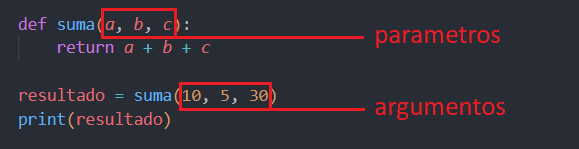

# <p align="center">Checkpoint 05</p>

## <p>📄 Documentación python 🐍</p>
|Contenido    |
|-----------------|
|**1. Condicionales** |
|**2. Bucles for, while y para que sirven**  |
|**3. Comprensión de listas** |
|**4. Argumentos** |
|**5. Función Lambda** |
|**6. Paquete pip** |
<br>
<br>

## 1. ¿Qué es un condicional?
<p>Para escribir programas útiles, casi siempre necesitamos la capacidad de comprobar ciertas condiciones y cambiar el comportamiento del programa como corresponda. Las sentencias condicionales nos dan esta capacidad. La forma más sencilla es la sentencia <code>if</code>.</p>

<p>El encabezado empieza con la palabra reservada <code>if</code> y termina con dos puntos <code>:</code>.</p>

**1.1. Condicional:**

```{python}
edad = 20
if edad >= 18:
    print(f'Soy mayor de edad porque tengo {edad} años.')
```

<p>La expresión que sigue a la sentencia <code>if</code> se llama condición. Si es verdadera, entonces la sentencia sangrada se ejecuta. Si no lo es, no pasa nada.</p>

**1.2. Condicional alternativa:**

```{python}
edad = 16
if edad >= 18:
    print(f'Soy mayor de edad porque tengo {edad} años.')
else:
    print(f'Soy menor de edad porque tengo {edad} años.')
```

<p>Veamos ahora la alternativa con el <code>if</code> <code>else</code>. Si la primera condición <code>if</code> no se cumple, se ejecutara la alternativa <code>else</code>.</p>

**1.3. Condicional encadenada:**

```{python}
edad = 70
if edad >= 67:
    print(f'Tengo {edad} años y estoy jubilado.')
elif edad >= 18:
    print(f'Soy mayor de edad porque tengo {edad} años.')
else:
    print(f'Soy menor de edad porque tengo {edad} años.')
```

<p>A veces hay más de dos posibilidades y necesitamos más de dos ramas. Una forma de expresar tal cómputo es una condicional encadenada con <code>elif</code>. La ejecución entrara unicamente en una de las ramas dando prioridad de ejecución de arriba hacia abajo.</p>
<br>


## 2. Tipos de bucle y para que sirven
<p>En Python, los bucles se utilizan para repetir varias veces la ejecución de una parte de un programa.</p>
<p>Hay dos tipos de bucles:</p>

  1. Bucle <code>for</code>:
      - Cuando se sabe de antemano cuántas veces se va a repetir el programa.
  2. Bucle <code>while</code>:
      - Cuando no se conoce de antemano el número de repeticiones del programa.

<p>Para interrumpir un bucle, se utiliza la palabra reservada <code>break</code> y para continuar el bucle en caso de cumplir alguna de las condiciones se utiliza <code>continue</code></p>

**2.1. El bucle for:**
<p>Un bucle <code>for</code> es un bucle que repite el bloque de instrucciones un número prederminado de veces. El bloque de instrucciones que se repite se suele llamar cuerpo del bucle y cada repetición se suele llamar iteración.</p>

<p>Su sintaxis es la siguiente:</p>

```{python}
productos = ['manzana', 'pera', 'naranja', 'sandia', 'melon'] # esto es una lista
for producto in productos:
    print(producto)

# salida:
    # manzana
    # pera
    # naranja
    # sandia
    # melon
```

**2.2. El bucle while:**
<p>Con el bucle <code>while</code> podemos ejecutar un conjunto de sentencias siempre que una condición sea verdadera.</p>

<p>Su sintaxis es la siguiente:</p>

```{python}
i = 4
while i < 7:
    print(i)
    i += 1

# salida:
    # 4
    # 5
    # 6
```
<br>


## 3. ¿Qué es comprensión de listas?
<p>La comprensión de listas nos permite crear nuevas listas a partir de otras listas, tuplas y cualquier iterable en una sola línea de código.</p>
<p>En este ejemplo, vamos a utilizar los valores de (lista_1) para multiplicar entre si 1x1, 2x2, 3x3, 4x4 y 5x5 mediante un bucle for y lo vamos a guardar en (lista_2). Para ello utilizaremos el metodo tradicional y el metodo de compresión de listas para ver las diferencias.</p>

**3.1. Ejemplo tradicional:**

```{python}
lista_1 = [1, 2, 3, 4, 5]
lista_2 = []
for num in lista_1:
    lista_2.append(num*num)
print(lista_2)
```

**3.2. Ejemplo comprensión de listas:**

```{python}
lista_1 = [1, 2, 3, 4, 5]
lista_2 = [num*num for num in lista_1]
print(lista_2)
```
<br>


## 4. ¿Qué es un argumento?
<p>Lo primero que debemos tener claro es saber la diferencias entre argumentos y parámetros. Recordando que un argumento no será más que el valor que vamos a ingresar al momento de llamar a una función, y los parámetros serán variables definidas en la función misma que podrán almacenar los argumentos ingresados.</p>

**4.1. Argumento en una llamada a la función:**



En el ejemplo siguiente, <code>24</code>, <code>Junio</code> y <code>1985</code> son los argumentos que se le estan pasando en la llamada a la función.

```{python}
def fecha_nacimiento(dia, mes, anio):
    return f'Mi fecha de nacimiento es el {dia} de {mes} de {anio}'

resultado = fecha_nacimiento(24, 'Junio', 1985)
print(resultado)

# salida: Mi fecha de nacimiento es el 24 de Junio de 1985
```


## 5. ¿Qué es una función Lambda?
<p>Una función Lambda lo que hace es crear pequeñas funciones anónimas sobre la marcha. Son perfectas para simplificar tareas a corto plazo y son más concisos y se definen en una sola línea sin necesidad de una declaración return.</p>
<p>Esto las hace ideales para operaciones sencillas de una sola vez.</p>

**5.1. Función estandar:**

```
def sumar(a, b):
    return a + b

resultado = sumar(6, 4)
print(resultado) # resultado: 10
```

**5.2. Función Lambda:**

```
suma = lambda a, b: a + b
print(suma(6, 4)) # resultado: 10
```


## 6. ¿Qué es un paquete pip?
<p>pip es un sistema de gestión de paquetes para Python. Su nombre proviene de “Pip Installs Packages”.</p>
<p>Los comandos mas utilizados son de instalar, actualizar, eliminar y comprobar la versión desde la terminal.</p>

Comandos desde windows:

```
pip install nombre_libreria -------------> Para instalar libreria.
pip install Nombre_libreria==2.1.1 ------> Para instalar una version especifica.
pip install nombre_libreria --upgrade ---> Para actualizar libreria.
pip install --upgrade pip ---------------> Para actualizar todos los paquetes instalados a su ultima versión.
pip unistall nombre_libreria ------------> Para desistalar libreria.
py --version ----------------------------> Para comprobar la version de python instalada.
pip freeze ------------------------------> Para mostrar una lista de las librerias instaladas.
```

<p>Una librería responde al conjunto de funcionalidades que permiten al usuario  llevar a cabo nuevas tareas que antes no se podían realizar o requerian muchisimas lineas de código.</p>

**6.1. Librería básica de Python:**
<p>Las librerías de Python básicas o bibliotecas estándar de Python son aquellas que vienen ya junto a Python. A continuación mencionare algunas.</p>

  - math
  - re

**6.2. Librerías de terceros:**
<p>A través de Pip es posible instalar paquetes y librerías de terceros de manera sencilla y eficiente. A continuación mencionare algunas.</p>

  - beautifulsoup
  - request
  - pandas
  - numpy

**6.3. Instalación de librerias en entornos virtuales:**
<p>Una de las principales ventajas de trabajar con ambientes virtuales es que nos permite crear entornos de desarrollo independientes para cada proyecto. De esta manera, no habrá conflictos entre las versiones de las distintas librerías que usemos en diferentes proyectos. A continuación mencionare una.</p>

  - virtualenv
