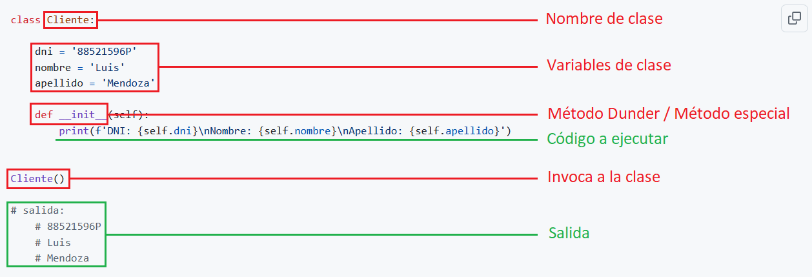
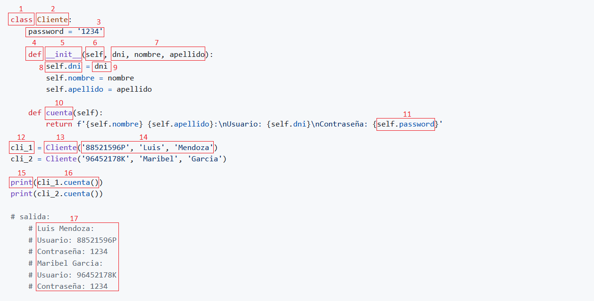

# <p align="center">Checkpoint 06</p>

## <p>📄 Documentación python 🐍</p>
|Contenido    |
|-----------------|
|**1. Introducción al uso de clases** |
|**2. Introducción a los métodos dunder**  |
|**3. -** |
|**4. -** |
|**5. -** |
|**6. -** |
<br>
<br>

## 1. Introducción al uso de clases
<p>Python es un lenguaje orientado a objetos, no es necesario hacer uso de ellas para poder crear un programa. De hecho, hemos estado trabajando hasta ahora sin hacer mención a ellas ni emplearlas.</p>

<p>Hasta ahora, hemos construido aplicaciones pequeñas de manera secuenciada y desorganizada. Esto no significa que lo hayamos hecho mal, lo que quiero decir es, que cuando empecemos a crear aplicaciones diámicas y sean mas complejas, necesitaremos mejorar la estructura del código, la organización y crear código reutilizable y facilitar su mantenimiento.</p>
<br>

### 1.1. Construir una clase de forma estática:

> [!NOTE]
> Las variables no son reutilizables ni tampoco permite pasarle argumentos.

[](#)
<br>

<p><strong>Código Python 👇</strong></p>

```python
class Cliente:

    dni = '88521596P'
    nombre = 'Luis'
    apellido = 'Mendoza'

    def __init__(self):
        print(f'DNI: {self.dni}\nNombre: {self.nombre}\nApellido: {self.apellido}')


Cliente()

# salida:
    # DNI: 88521596P
    # Nombre: Luis
    # Apellido: Mendoza
```

- ❌ Estructurado.
- ❌ Organizado.
- ❌ Escalable.
- ❌ Reutilizable.
<br>

### 1.2. Construir una clase de forma dinámica:

<p>La manera recomendada de contruir aplicaciónes con <strong>código reutilizable</strong> y <strong>organizada</strong>, es con el uso de las <strong>clases</strong>. Al principio, es normal que te sientas perdido con todo esto de las clases, pero no te preocupes, todos hemos pasado por esta etapa.</p>

<p>Para crear una clase, vamos a emplear la palabra reservada <code>class</code> seguido de un nombre escrito en PascalCase, primera letra de cada palabra se escribe en mayúscula, y sin guiones bajos. Sabemos que las <strong>clases</strong> pueden contener <strong>funciones</strong>, a las que llamamos <strong>métodos</strong>. Una <strong>clase</strong> también puede contener <strong>variables</strong>, a las que se conoce con el nombre de <strong>atributos</strong>. Para crear <strong>atributos</strong>, primero definimos un <strong>método especial</strong> llamado <code>__init__()</code>, que es invocado por Python automáticamente siempre que se crea una instancia de la clase (conocido también como <strong>constructor</strong> o <strong>inicializador</strong>).</p>

<p>Los <strong>clientes</strong> que vayamos a crear, no tendrán el mismo <code>dni</code>, <code>nombre</code> ni <code>apellido</code>. Por ello sería conveniente permitir que, al definir una instancia, se pase como <strong>argumento</strong> el <strong>dni del cliente</strong> y éste se almacene en el <strong>atributo</strong> <code>self.dni</code>, <strong>nombre del cliente</strong> en el <strong>atributo</strong> <code>self.nombre</code> y <strong>apellido del cliente</strong> en el <strong>atributo</strong> <code>self.apellido</code>.</p>
<br>

> [!IMPORTANT]
> Dentro de la clase, las variables pasan a llamarse <strong>atributos</strong>, el <strong>primer atributo obligatorio</strong> siempre sera <code>self</code>, las funciones pasan a llamarse <strong>métodos</strong>, nos permite pasarle <strong>argumentos</strong> y eso hace que el código sea <strong>reutilizable</strong>. Estas son las razones por el cual se crearon las clases en programación.

[](#)
<br>

<p><strong>Código Python 👇</strong></p>

```python
class Cliente:
    def __init__(self, dni, nombre, apellido):
        self.dni = dni
        self.nombre = nombre
        self.apellido = apellido
        
        print(f'DNI: {self.dni}\nNombre: {self.nombre}\nApellido: {self.apellido}')

Cliente('88521596P', 'Luis', 'Mendoza')
Cliente('96452178K', 'Maribel', '')

# salida:
    # DNI: 88521596P
    # Nombre: Luis
    # Apellido: Mendoza
    # DNI: 96452178K
    # Nombre: Maribel
    # Apellido:
```
<br>

### 1.3. Construir objetos con una clase de forma dinámica:
>[!TIP]
>Antes del auge de la POO, la programación estaba dominada por el paradigma procedimental. Este enfoque estructuraba los programas como una serie de instrucciones secuenciales y dependía en gran medida de funciones y datos globales. Si bien este modelo era efectivo para problemas simples, se volvió difícil de manejar a medida que los sistemas se hicieron más complejos debido a la falta de separación clara entre los datos y las operaciones.
<br>

**Python es un lenguaje multiparadigma:**
  - Soporta la programación imperativa y funcional.
  - Soporta la programación orientada a objetos (POO).
<br>

<p>En este ejemplo, vamos a crear <strong>2 objetos</strong> que se van a llamar <code>cli_1</code> y <code>cli_2</code>. <code>cli_1</code> va tener DNI, Nombre, Apellido y el <code>cli_2</code> va tener solamente DNI, Nombre. La ventaja de poder crear estos objetos de una forma tan simplificada, es impresionante.</p>
<br>

<p><strong>Código Python 👇</strong></p>

```python
class Cliente:

    def __init__(self, dni, nombre, apellido):
        self.dni = dni
        self.nombre = nombre
        self.apellido = apellido

cli_1 = Cliente('88521596P', 'Luis', 'Mendoza')
cli_2 = Cliente('96452178K', 'Maribel', '')

print(f'DNI: {cli_1.dni}\nNombre: {cli_1.nombre}\nApelllido: {cli_1.apellido}')
print(f'DNI: {cli_2.dni}\nNombre: {cli_2.nombre}')

# salida:
    # DNI: 88521596P
    # Nombre: Luis
    # Apellido: Mendoza
    # DNI: 96452178K
    # Nombre: Maribel
    # Apellido:
```
<br>

### 1.4. Construir métodos dentro de una clase de forma dinámica:
<p>En este ejemplo, vamos a crear un <strong>método normal</strong> llamado <code>cuenta</code>, el <strong>primer atributo</strong> obligatorio se llama <code>self</code>, seguido pondremos nuestros <strong>atributos</strong> opcionales separadas por una <code>,</code>coma y cerramos la linea con <code>:</code> dos puntos.</p>

<p>Dentro del método, <strong>indentamos</strong> con 4 espacios para empezar a escribir nuestro <strong>código de ejecución</strong>. En este caso, vamos a emplear <code>return</code> para retornar un mensaje que ponga <strong>Cuenta: El cliente ????????? tiene cuenta</strong>. Con esto, ya tendriamos nuestra clase completado.</p>

<p>Utilizaremos los mismos <strong>objetos</strong> <code>cli_1</code> y <code>cli_2</code> creados en el ejercicio anterior. La forma de acceder a ello es, llamamos primero al objeto <code>cli_1</code> y ponemos un <code>.</code> punto y llamamos al metodo <code>cuenta</code>. Al tratarse de un método, como toda función, devemos cerrarla con <code>()</code>parentesis. El código quedaria de la siguiente manera <code>cli_1.cuenta()</code></p>

<p>Finalizamos el ejemplo con la función <code>print()</code> para <strong>imprimir en pantalla</strong> lo que hemos programado en esta <strong>clase</strong>, <code>print(cli_1.cuenta())</code> y <code>print(cli_2.cuenta())</code></p>
<br>

<p><strong>Código Python 👇</strong></p>

```python
class Cliente:

    def __init__(self, dni, nombre, apellido):
        self.dni = dni
        self.nombre = nombre
        self.apellido = apellido

    def cuenta(self):
        return f'Cuenta: El cliente {self.dni} tiene cuenta'

cli_1 = Cliente('88521596P', 'Luis', 'Mendoza')
cli_2 = Cliente('96452178K', 'Maribel', '')

print(cli_1.cuenta())
print(cli_2.cuenta())

# salida:
    # Cuenta: El cliente 88521596P tiene cuenta
    # Cuenta: El cliente 96452178K tiene cuenta
```
<br>

### 1.5. Conceptos básicos en una clase:

<p>Llegados aqui, aprenderemos los conceptos básicos que construyen una clase. Trata de leer el código y entender lo que sucede en cada paso.</p>

[](#)

> [!NOTE]
> 📚 **Descripción de conceptos:**

1. <code>class</code> Declara una <strong>clase</strong>.
2. <code>Cliente</code> Asigna un <strong>nombre</strong> a la clase, siempre en PascalCase y sin guiones bajos.
3. <code>password = '1234'</code> Declara una <strong>variable de clase</strong>.
4. <code>def</code> Declara un <strong>método</strong>.
5. <code>\__init__</code> Lleva dos guiones al principio y al final del nombre, se le conoce como <strong>método dunder, especial o mágico</strong>.
6. <code>self</code> Es el <strong>primer atributo obligatorio</strong> siempre.
7. <code>dni</code>,<code>nombre</code>, <code>apellido</code> Se llaman <strong>atributos</strong> del método y van separados por una <code>,</code> coma.
8. <code>self.dni</code> Declara una <strong>variable de instancia</strong>.
9. <code>dni</code> Guarda el <strong>valor</strong> de la variable de instancia.
10. <code>cuenta</code> Asigna un <strong>nombre</strong> al método.
11. <code>self.password</code> <strong>Hace referencia</strong> a la variable de instancia para retornar su valor.
12. <code>cli_1</code> Crea un <strong>objeto</strong>.
13. <code>Cliente</code> <strong>Invoca</strong> a la clase desde cualquier parte de la aplicación.
14. <code>'88521596P'</code>, <code>'Luis'</code>, <code>'Mendoza'</code> Se llaman <strong>argumentos</strong>.
15. <code>Print</code> Es una función para <strong>imprimir</strong> en pantalla.
16. <code>cli_1.cuenta</code> hace referencia al <strong>objeto</strong> <code>cli_1</code> para acceder a la clase y ejecutar el <strong>método</strong> <code>cuenta</code>.
17. Visualizamos los datos en la pantalla.
<br>

<p><strong>Código Python 👇</strong></p>

```python
class Cliente:
    password = '1234'

    def __init__(self, dni, nombre, apellido):
        self.dni = dni
        self.nombre = nombre
        self.apellido = apellido

    def cuenta(self):
        return f'{self.nombre} {self.apellido}:\nUsuario: {self.dni}\nContraseña: {self.password}'

cli_1 = Cliente('88521596P', 'Luis', 'Mendoza')
cli_2 = Cliente('96452178K', 'Maribel', 'Garcia')

print(cli_1.cuenta())
print(cli_2.cuenta())

# salida:
    # Luis Mendoza:
    # Usuario: 88521596P
    # Contraseña: 1234
    # Maribel Garcia:
    # Usuario: 96452178K
    # Contraseña: 1234
```
- ✅ Facil de estructurar.
- ✅ Facil de organizar.
- ✅ Facil de leer.
- ✅ Facil de escalar.
- ✅ Código reutilizable.

> [!IMPORTANT]
> Las variables de clase son útiles cuando queremos utilizar un mismo valor en cualquiera de los metodos. Son accesibles desde cualquier método. Dentro de las clases, no se recomienda el uso de las condicionales. Su uso está enfocado en gestionar datos y métodos.

💬 Es fundamental entender bien la estructura y la lógica de las clases para poder seguir avanzando y evitar estancamientos en el futuro.
<br>
<br>

## 2. Introducción a los métodos dunder:
