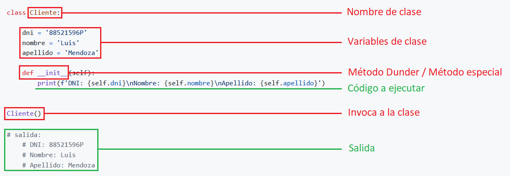

# <p align="center">Checkpoint 06</p>

## <p>📄 Documentación python 🐍</p>
|Contenido    |
|-----------------|
|**1. Clases** |
|**2. Bucles for, while y para que sirven**  |
|**3. Comprensión de listas** |
|**4. Argumentos** |
|**5. Función Lambda** |
|**6. Paquete pip** |
<br>
<br>

## 1. ¿Que es una clase?
<p>Python es un lenguaje orientado a objetos, de modo que tiene soporte de primer nivel para la creación de clases. No es necesario hacer uso de ellas para poder crear un programa. De hecho, hemos estado trabajando hasta ahora sin hacer mención a ellas ni emplearlas directamente.</p>

<p>Hasta ahora, hemos estado construyendo aplicaciones pequeñas de manera secuenciada y desorganizada. Esto no significa que lo hayamos estado haciendo mal, lo que quiero decir es, que cuando empecemos a crear aplicaciones con muchas mas líneas de código, necesitaremos que de alguna forma nuestra aplicación tenga la estructura del código y la lógica bien organizado y que el código sea facil de mantener.</p>
<br>

### 1.1. Creación de una clase de forma incorrecta:

> [!IMPORTANT]
> **Las variables no son reutilizables ni tampoco permite pasar argumentos.**

[](#)

```python
class Cliente:

    dni = '88521596P'
    nombre = 'Luis'
    apellido = 'Mendoza'

    def __init__(self):
        print(f'DNI: {self.dni}\nNombre: {self.nombre}\nApellido: {self.apellido}')


Cliente()

# salida:
    # DNI: 88521596P
    # Nombre: Luis
    # Apellido: Mendoza
```
<br>

### 1.2. Creación de una clase de forma correcta:

<p>La forma correcta de contruir aplicaciónes con <strong>código reutilizable</strong> y poder tener todo bien <strong>organizado</strong> es con el uso de las <strong>clases</strong>. Al principio, es normal que te sientas perdido con todo esto de las clases, pero no te preocupes, todos hemos pasado por esta etapa.</p>

<p>Para crear una clase vamos a emplear la palabra reservada <code>class</code> seguido de un nombre escrito en PascalCase, primera letra de cada palabra se escribe en mayúscula, y sin guiones bajos. Sabemos que las <strong>clases</strong> pueden contener <strong>funciones</strong>, a las que llamamos <strong>métodos</strong>. Una <strong>clase</strong> también puede contener <strong>variables</strong>, a las que se conoce con el nombre de <strong>atributos</strong>. Para crear <strong>atributos</strong>, primero definimos un <strong>método especial</strong> llamado <code>__init__()</code>, que es invocado por Python automáticamente siempre que se crea una instancia de la clase (conocido también como <strong>constructor</strong> o <strong>inicializador</strong>).</p>

<p>Los <strong>clientes</strong> que vayamos a crear, no tendrán el mismo <code>dni</code>, <code>nombre</code> ni <code>apellido</code>. Por ello sería conveniente permitir que, al definir una instancia, se pase como <strong>argumento</strong> el <strong>dni del cliente</strong> y éste se almacene en el <strong>atributo</strong> <code>self.dni</code>, <strong>nombre del cliente</strong> en el <strong>atributo</strong> <code>self.nombre</code> y <strong>apellido del cliente</strong> en el <strong>atributo</strong> <code>self.apellido</code>.</p>
<br>

> [!IMPORTANT]
> **Dentro de la clase, las variables pasan a llamarse atributos, el primer atributo obligatorio siempre sera <code>self</code>, las funciones pasan a llamarse métodos, nos permite pasarle argumentos y eso hace que el código sea reutilizable. Estas son las razones por el cual se crearon las clases en programación.**

[](#)

```python
class Cliente:
    def __init__(self, dni, nombre, apellido):
        self.dni = dni
        self.nombre = nombre
        self.apellido = apellido
        
        print(f'DNI: {self.dni}\nNombre: {self.nombre}\nApellido: {self.apellido}')

Cliente('88521596P', 'Luis', 'Mendoza')
Cliente('96452178K', 'Maribel', '')

# salida:
    # DNI: 88521596P
    # Nombre: Luis
    # Apellido: Mendoza
    # DNI: 96452178K
    # Nombre: Maribel
    # Apellido:
```

